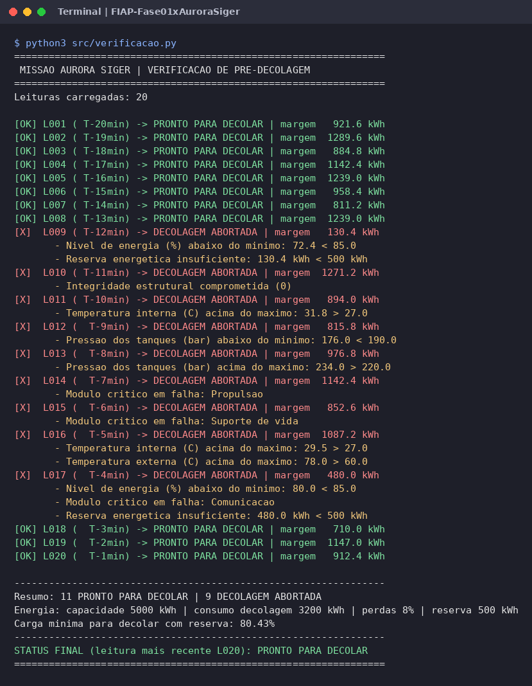
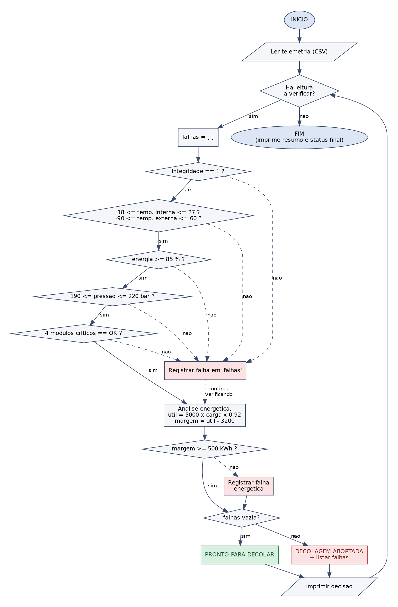
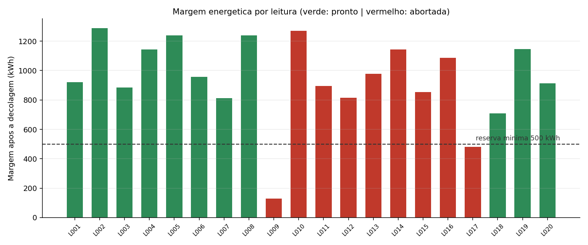
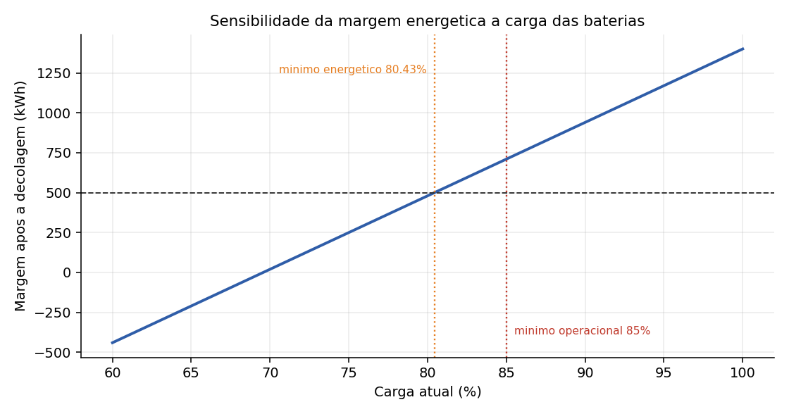

# Missão Aurora Siger | Relatório Operacional de Pré-Decolagem

Atividade Integradora da Fase 1 (FIAP). **Grupo 30:** Jean Melo.

## Sobre o projeto

Na missão Aurora Siger, o analista de controle precisa validar os parâmetros técnicos da nave Aurora antes da decolagem. Este projeto simula esse processo:

1. **Telemetria:** um dataset com 20 leituras de pré-decolagem (temperaturas interna e externa, integridade estrutural, nível de energia, pressão dos tanques e status de 4 módulos críticos).
2. **Algoritmo de verificação:** fluxograma e pseudocódigo que decidem entre `PRONTO PARA DECOLAR` e `DECOLAGEM ABORTADA` com base em faixas seguras.
3. **Script em Python:** lê o CSV, executa as verificações e imprime a decisão de cada leitura com os motivos de cada aborto.
4. **Análise energética:** calcula energia útil, margem após a decolagem e autonomia a partir da capacidade, carga, consumo e perdas.
5. **Análise assistida por IA:** classificação dos dados, anomalias e sugestões de risco.
6. **Reflexão crítica:** ética, impacto social e sustentabilidade da exploração espacial.

## Faixas seguras do protocolo

| Variável | Faixa segura |
|---|---|
| Temperatura interna | 18 a 27 °C |
| Temperatura externa | -90 a 60 °C |
| Integridade estrutural | 1 (íntegra) |
| Nível de energia | 85 a 100 % |
| Pressão dos tanques | 190 a 220 bar |
| Módulos críticos (propulsão, navegação, suporte de vida, comunicação) | todos `OK` |
| Margem energética após a decolagem | pelo menos 500 kWh |

## Análise energética

Parâmetros: capacidade total de 5.000 kWh, consumo estimado na decolagem de 3.200 kWh, perdas de 8%, consumo de 45 kW após a decolagem.

```
energia armazenada = capacidade x carga / 100
energia útil       = armazenada x (1 - 0,08)
margem             = energia útil - 3200
autonomia (h)      = margem / 45
```

Carga mínima para decolar mantendo a reserva: **80,43%** (o protocolo exige 85% como margem de segurança).

## Estrutura

```
FIAP-Fase01xAuroraSiger/
├── data/telemetria_aurora.csv      # dataset de telemetria
├── notebook/aurora_siger.ipynb     # notebook com toda a análise executada
├── src/
│   ├── aurora.py                   # faixas seguras, verificações e análise energética
│   └── verificacao.py              # script principal
├── docs/
│   ├── algoritmo/pseudocodigo.txt  # pseudocódigo do algoritmo
│   ├── analise_ia.md               # prompt e resposta da IA
│   ├── reflexao_critica.md
│   └── relatorio_aurora_siger.pdf  # relatório final
└── assets/                         # imagens (fluxograma, prints, gráficos)
```

## Como executar

Requisitos: Python 3.10 ou superior.

```bash
git clone https://github.com/jean-fiap/FIAP-Fase01xAuroraSiger.git
cd FIAP-Fase01xAuroraSiger
pip install -r requirements.txt

# script de verificação
python3 src/verificacao.py

# notebook
jupyter notebook notebook/aurora_siger.ipynb
```

## Prints da execução

**Script de verificação no terminal**



**Fluxograma do algoritmo**



**Margem energética por leitura**



**Sensibilidade da margem à carga das baterias**



## Resultado

- 11 leituras **PRONTO PARA DECOLAR** e 9 **DECOLAGEM ABORTADA**, cada aborto com o motivo listado.
- Status final (leitura L020, T-1min): **PRONTO PARA DECOLAR**, confirmado também pela janela de estabilidade de 3 leituras sugerida pela IA.
